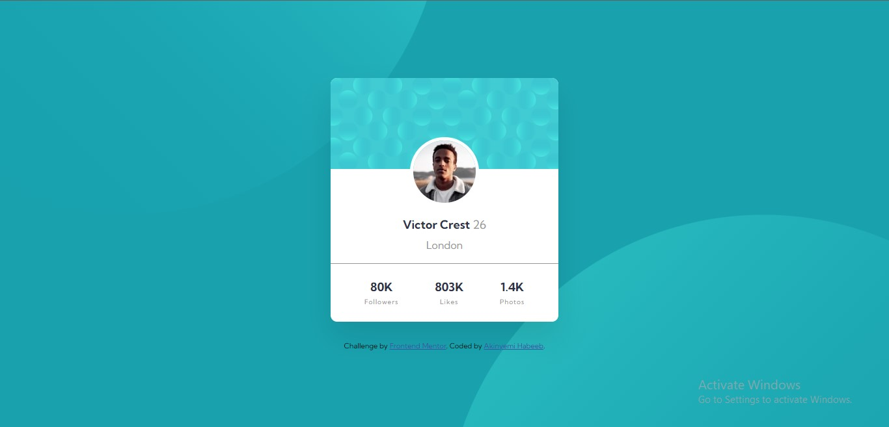

# Frontend Mentor - Profile card component solution

This is a solution to the [Profile card component challenge on Frontend Mentor](https://www.frontendmentor.io/challenges/profile-card-component-cfArpWshJ). Frontend Mentor challenges help you improve your coding skills by building realistic projects. 

## Table of contents

- [Overview](#overview)
  - [The challenge](#the-challenge)
  - [Screenshot](#screenshot)
  - [Links](#links)
- [My process](#my-process)
  - [Built with](#built-with)
  - [What I learned](#what-i-learned)
  - [Continued development](#continued-development)
  - [Useful resources](#useful-resources)
- [Author](#author)
- [Acknowledgments](#acknowledgments)

## Overview
- This is the profile card component challenge on frontend targeted basically to develop a newbie developer skills on how to use the "position","transform", and "background-image" elements in CSS.

### The challenge

- Build out the project to the designs provided

### Screenshot

### Links

- Solution URL: [Solution URL](https://github.com/Akinyemi4/profile-code-component)
- Live Site URL: [Live Site URL](https://profile-card-component-akinyemi4.netlify.app/)

## My process
- I started the challenge with the HTML section putting in it the basic sections of the design then i proceeded to the CSS section to design it to the look of the designs provided.

### Built with

- Semantic HTML5 markup
- CSS custom properties
- Flexbox

### What I learned

- I gained a lot in this challenge but to meVtion a few I'll summarize it all in the following:
** I learnt how to make an image fit nicely into its parent.
** I learnt how to use the value "space-around" in flexbox.

### Continued development

- I'll like to work more on how to use the style "position".
- I'll love to explore the different values under the "background-image" style.
- Coding faster and effectively is the dream of every programmer so I'll love to work more on that.

### Useful resources

- [How to use background image](https://developer.mozilla.org/en-US/docs/Web/CSS/CSS_Backgrounds_and_Borders/Using_multiple_backgrounds) - This helped me to understand how to use multiple background images.

## Author

- Website - [Add your name here](https://www.your-site.com)
- Frontend Mentor - [@Akinyemi4](https://www.frontendmentor.io/profile/yourusername).

## Acknowledgments

- I really appreciate the brains behind frontend mentor, more grease to your elbow.Likewise the other developers that help others with their knowledge in the community.Thanks to you guys.

